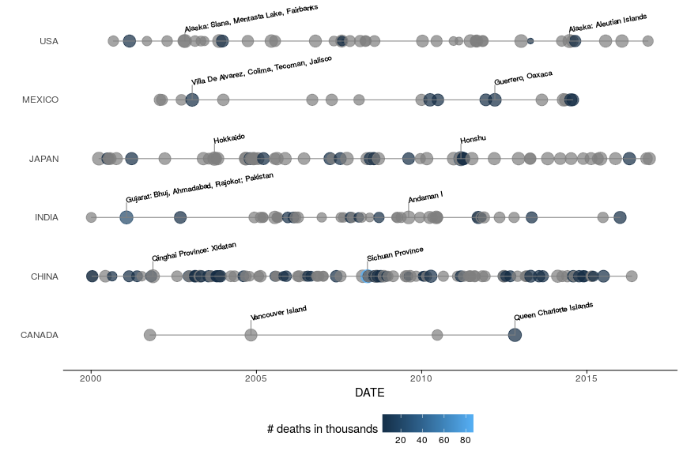

<!--
  README.md is generated from README.Rmd, so you should edit that file.
-->
rnoaa 
=================================================================

[](https://travis-ci.org/Cesar-Urteaga/rnoaa) [](https://ci.appveyor.com/project/Cesar-Urteaga/rnoaa)

Overview
--------

`rnoaa` is an [R](https://www.r-project.org/) package with a set of functions that makes easier to analyze the earthquake data provided by the [U.S. National Oceanic and Atmospheric Administration (NOAA)](http://www.noaa.gov/).

Installation
------------

``` r
# Install the package from GitHub without the vignette:
devtools::install_github("Cesar-Urteaga/rnoaa")

# Or you can include it:
devtools::install_github("Cesar-Urteaga/rnoaa", build_vignettes = TRUE)
```

Usage
-----

This package allows you to get and clean the latest earthquake data from [the NOAA's Webpage](https://www.ngdc.noaa.gov/nndc/struts/form?t=101650&s=1&d=1) so as to prepare it for analysis:

``` r
library(rnoaa)
library(dplyr)

# GETTING THE DATA
#   In case you do not have internet access, you can use the get_earthquake_data
#   function, which is a snapshot of the quake's data on September 10, 2017:
#   raw_data <- get_earthquake_data()
raw_data <- download_earthquake_data()

# TIDYING THE DATA UP
#   Before the data has been processed:
set.seed(48)
raw_data %>%
  select(YEAR, MONTH, DAY, COUNTRY, LOCATION_NAME) %>%
  sample_n(6)
# A tibble: 6 x 5
   YEAR MONTH   DAY     COUNTRY                        LOCATION_NAME
  <int> <int> <int>       <chr>                                <chr>
1  1946     8     2       CHILE                     CHILE:  NORTHERN
2   778    NA    NA       ITALY                      ITALY:  TREVISO
3  -426     6    NA      GREECE                      GREECE:  EUBOEA
4  1885     1    14       CHINA               CHINA:  GANSU PROVINCE
5  1802    12     9       JAPAN JAPAN:  NW HONSHU:  SADO ISLAND, OGI
6  1576     5    23 EL SALVADOR             EL SALVADOR:  SAN MARCOS
#   We use the two rnoaa's functions to clean the data.
clean_data <- raw_data %>%
  eq_clean_data() %>%
  eq_location_clean()
#   After the data has been processed (note that the DATE variable has been
#   created and the country has been removed for the LOCATION_NAME variable):
set.seed(48)
clean_data %>%
  select(YEAR, MONTH, DAY, DATE, COUNTRY, LOCATION_NAME) %>%
  sample_n(6)
# A tibble: 6 x 6
   YEAR MONTH   DAY       DATE     COUNTRY               LOCATION_NAME
  <int> <int> <int>     <date>       <chr>                       <chr>
1  1946     8     2 1946-08-02       CHILE                    Northern
2   778    NA    NA  778-07-02       ITALY                     Treviso
3  -426     6    NA -426-06-15      GREECE                      Euboea
4  1885     1    14 1885-01-14       CHINA              Gansu Province
5  1802    12     9 1802-12-09       JAPAN Nw Honshu: Sado Island, Ogi
6  1576     5    23 1576-05-23 EL SALVADOR                  San Marcos
#   N.B.: When the month or/and day is/are missing, the date is approximated
#         at the midpoint of the period.
```

Once the data was tidied, `rnoaa` includes two ggplot2's geoms to visualize the timeline in which the quakes have ocurred and label the ones with the greater magnitude:

``` r
library(ggplot2)
clean_data %>%
  filter(COUNTRY %in% c("CANADA", "USA", "MEXICO",
                        "CHINA", "JAPAN", "INDIA"),
         !is.na(EQ_PRIMARY),
         YEAR %in% 2000:2016) %>%
  ggplot(mapping = aes(x = DATE,
                       y = COUNTRY,
                       size = EQ_PRIMARY,
                       color = TOTAL_DEATHS / 1000,
                       label = LOCATION_NAME)
         ) +
  geom_timeline() +
  geom_timeline_label(# We want to show the label for at most the two highest
                      # earthquakes by size.
                      n_max = 2,
                      line_height = 1 / 4,
                      angle = 10,
                      fontsize = 2.5) +
  labs(size = "Richter scale value",
       color = "# deaths in thousands",
       y = "") +
  guides(size = FALSE) +
  theme_timeline()
```



Furthermore, it provides with functions to display the epicenters in an interactive R leaflet map:

``` r
clean_data %>%
  dplyr::filter(COUNTRY == "JAPAN" & lubridate::year(DATE) >= 2000) %>%
  eq_map(annot_col = "DATE")
```


Also, it assists you to display the quake's traits from the data using popup text labels:

``` r
clean_data %>%
  dplyr::filter(COUNTRY == "MEXICO" & lubridate::year(DATE) == 2017) %>%
  dplyr::mutate(popup_text = eq_create_label(.)) %>%
  eq_map(annot_col = "popup_text")
```


Documentation
-------------

Please check the [package's vignette](./vignettes/using-rnoaa.Rmd) to see how the package works or review the examples given in the package's documentation (use `?function_name`); you can run them with the function `example` (e.g., `example("geom_timeline_label")`).

Unit Testing
------------

In order to increase the quality of the package, a [set of tests](./tests/testthat) were carried out for each function using the `testthat` R package.

Development Workflow
--------------------

The workflow that was used to develop this package is described [here](https://github.com/Cesar-Urteaga/rfars#workflow).
